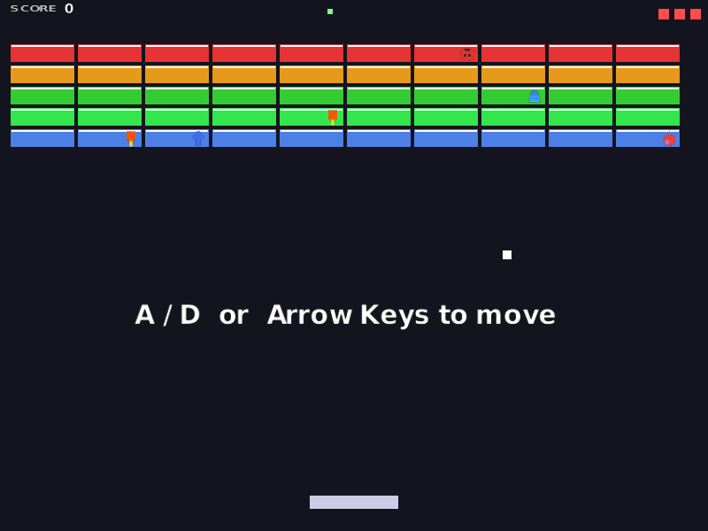

# loft — build small games, share a link, anyone plays

[](LICENSE)

[**▶ Try it in the browser**](https://jjstwerff.github.io/loft/playground.html) · [**🎮 Play Brick Buster**](https://jjstwerff.github.io/loft/brick-buster.html) · [**🖼 Graphics gallery**](https://jjstwerff.github.io/loft/gallery.html) · [**📘 Docs**](https://jjstwerff.github.io/loft/)

---

## What can you actually make with it?

<p align="center">
  <a href="https://jjstwerff.github.io/loft/brick-buster.html">
    
  </a>
</p>

**A complete arcade game** — paddle, ball, coloured bricks, 7 different powerups (including a rising balloon bomb you can knock sideways with the ball), pause, game-over, chiptune music that rotates between three original tracks, sound effects, hand-designed levels, and an animated 12-piece paddle explosion — written in loft and running in your browser. Click the image above, press **Space**, play. No install, no sign-up, no download.

And it's one file: [`25-brick-buster.loft`](lib/graphics/examples/25-brick-buster.loft).

### What's new in 0.8.4

- **Hand-designed levels 1–5** introduce the powerups gradually (gentle 3-row opener, shoulder-gap pyramid, down-arrow with explode tip, smile-face layout) before the procedural generator takes over at level 6+ with progressively denser specials.
- **Cel-shaded sprite pass** — every icon and the ball have dark outlines; the ball is an actual round sprite with a four-frame squash animation that stretches along its velocity direction (bounces look like bounces, not axis-aligned flips).
- **Heart-shaped lives** replace the red squares in the HUD, the level is shown as a Roman numeral in the top middle, a persistent high score is stored in `.loft/brickbuster_score.txt` and shown below the score.
- **Balloon powerup** is now an actual projectile: launches from the paddle, can be knocked sideways with the ball (top half bounces it up, bottom half bounces it down), explodes on brick contact with screen shake.
- **Fireball after-images** fade from orange to grey behind a burning ball.
- **Three-track chiptune playlist** plays once per level in a random rotation with 3–8 s silences between songs.

## Three ways to see loft

| | |
|---|---|
| **🌐 [Playground](https://jjstwerff.github.io/loft/playground.html)** | Type a few lines of loft, press run, see output. That *is* the whole tutorial. |
| **🖼 [Gallery](https://jjstwerff.github.io/loft/gallery.html)** | 24 interactive graphics demos, from hello-triangle to physically-based rendering with shadows — every one running live in WebGL. |
| **💻 [Install locally](doc/claude/DEVELOPMENT.md)** | `cargo install --git https://github.com/jjstwerff/loft --bin loft` |

---

## Why people like it

- **Write once, runs in the browser and on your desktop.** The same source compiles to WebAssembly+WebGL for browsers and to a native binary using OpenGL for Mac/Linux/Windows.
- **Reads like Python, runs fast like Rust.** Statically typed with almost no annotations — loft infers types, catches mistakes at compile time, and runs interpreted *or* compiled.
- **Shareable by link.** A finished loft program is a directory of static files. Put it on any web host. Send someone the URL. They play.
- **Trivially embeddable.** Loft is a Rust crate. Drop it into an existing Rust application to script game logic, hot-reload configs, or run untrusted code safely.

## What does the code look like?

```loft
struct Point { x: float, y: float }

fn distance(a: Point, b: Point) -> float {
    dx = a.x - b.x
    dy = a.y - b.y
    sqrt(dx * dx + dy * dy)
}

fn main() {
    p1 = Point { x: 0.0, y: 0.0 }
    p2 = Point { x: 3.0, y: 4.0 }
    println("distance: {distance(p1, p2)}")
}
```

```
$ loft hello.loft
distance: 5.0
```

Everything you might want is there: `vector<T>`, `sorted<T>`, `index<T>`, `hash<T>` collections; `par(...)` for parallel loops; `yield` for generators; pattern matching with `match`; null-safe with `?? default`; format strings like Rust's.

## Getting started

```sh
# one-line install (requires Rust toolchain)
cargo install --git https://github.com/jjstwerff/loft --bin loft

# or clone + build
git clone https://github.com/jjstwerff/loft
cd loft
cargo build --release     # binary at target/release/loft

# try an example
./target/release/loft lib/graphics/examples/01-hello-window.loft
```

Pre-built binaries on the [Releases](https://github.com/jjstwerff/loft/releases) page.

## Graphics examples

24 progressive examples. Hover each for a live preview in the [gallery](https://jjstwerff.github.io/loft/gallery.html):

| File | What it shows |
|---|---|
| `01-hello-window.loft` | A green window |
| `10-2d-canvas.loft` | 2D drawing primitives |
| `08-basic-lighting.loft` | Phong lighting on a 3D cube |
| `16-shadow-mapping.loft` | Real-time shadows |
| `18-pbr.loft` | Physically-based rendering |
| `24-renderer-demo.loft` | Full scene with PBR + shadows — **no shader code** |
| **`25-brick-buster.loft`** | **A complete arcade game** |

See the [full example list](lib/graphics/examples/README.md).

## Contributing

Highest-impact areas today:

- **Example games** — small playable demos that showcase the language
- **Game library** — input, sprites, tilemaps, collision, audio abstractions
- **WebGL backend** — closing the last gaps between native and browser rendering
- **Documentation polish** — every page runs as a test, so contributions stay correct by construction

See [DEVELOPMENT.md](doc/claude/DEVELOPMENT.md) for the workflow and [PLANNING.md](doc/claude/PLANNING.md) for the roadmap.

## Documentation

Full reference, tutorial, API, and printable PDF at <https://jjstwerff.github.io/loft/>.

Build locally: `make wasm` (Playground + Gallery) then `cargo run --bin gendoc` (HTML pages), open `doc/index.html`. Or `make gallery` for a one-shot verify-and-rebuild of the whole gallery stack.

## License

LGPL-3.0-or-later — see [LICENSE](LICENSE).
