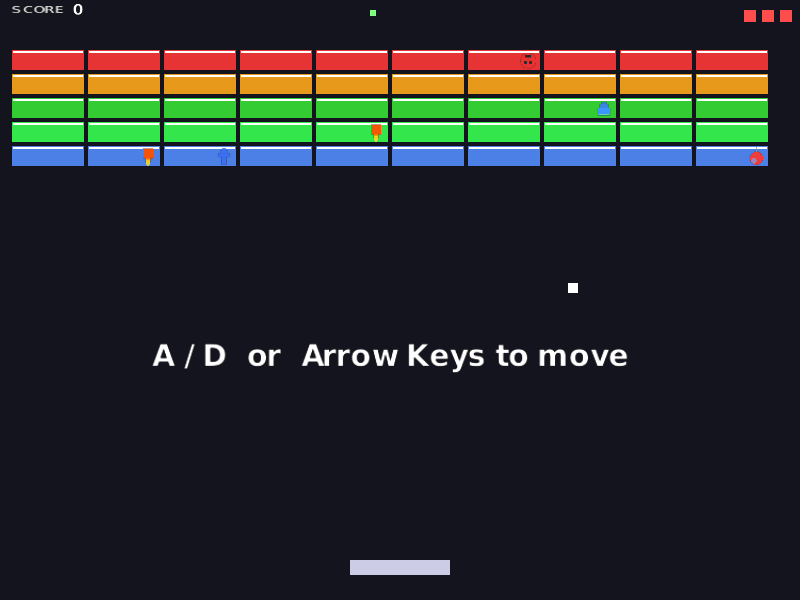

# loft — build small games, share a link, anyone plays

[](https://github.com/loft-lang/loft/actions/workflows/ci.yml)
[](LICENSE)
[](https://github.com/loft-lang/loft/releases)
[](https://loft-lang.org/loft/gallery.html)

[**▶ Try it in the browser**](https://loft-lang.org/loft/playground.html) · [**🎮 Play Brick Buster**](https://loft-lang.org/loft/brick-buster.html) · [**🖼 Graphics gallery**](https://loft-lang.org/loft/gallery.html) · [**📘 Docs**](https://loft-lang.org/loft/)

---

## What can you actually make with it?

<p align="center">
  <a href="https://loft-lang.org/loft/brick-buster.html">
    
  </a>
</p>

**A complete arcade game** — paddle, ball, coloured bricks, 7 different powerups, chiptune music, hand-designed levels, pause, game-over, sound effects, animated paddle explosion — written in loft and running in your browser. Click the image above, press **Space**, play. No install, no sign-up, no download.

The whole game is one file — [read all 1,849 lines](tools/brick-buster/25-brick-buster.loft). No engine and no framework: that file *is* the game. Its sprite sheet is *art*, not code — drawn once by [a build step](tools/brick-buster/pack_atlas.loft) into a content pack the game reads, and that the browser page carries inside itself.

## Three ways to see loft

| | |
|---|---|
| **🌐 [Playground](https://loft-lang.org/loft/playground.html)** | Type a few lines of loft, press run, see output. That *is* the whole tutorial. |
| **🎮 [Brick Buster](https://loft-lang.org/loft/brick-buster.html)** | A complete arcade game, running live in WebGL. Press Space to play, then read the one file it is written in. |
| **💻 [Install locally](doc/claude/DEVELOPMENT.md)** | `cargo install --git https://github.com/loft-lang/loft --bin loft` |

---

## Why people like it

- **Write once, runs in the browser and on your desktop.** The same source compiles to WebAssembly+WebGL for browsers and to a native binary using OpenGL for Mac/Linux/Windows.
- **Reads like Python, runs fast like Rust.** Statically typed with almost no annotations — loft infers types and catches mistakes at compile time. By default it **compiles to native code** through rustc; add `--interpret` for instant startup, or `--native-wasm` for the browser.
- **Batteries via packages.** `loft install <name>` pulls libraries from the registry — graphics, imaging, input, an HTTP server, a markdown renderer — each itself written in loft. Bounded generics and interfaces keep those libraries type-safe without ceremony.
- **Shareable by link.** A finished loft program is a directory of static files. Put it on any web host. Send someone the URL. They play.
- **Trivially embeddable.** Loft is a Rust crate. Drop it into an existing Rust application to script game logic, hot-reload configs, or run untrusted code safely.

## What does the code look like?

```loft
struct Point { x: float, y: float }

fn distance(a: Point, b: Point) -> float {
    dx = a.x - b.x;
    dy = a.y - b.y;
    sqrt(dx * dx + dy * dy) ?? 0.0
}

fn main() {
    p1 = Point { x: 0.0, y: 0.0 };
    p2 = Point { x: 3.0, y: 4.0 };
    println("distance: {distance(p1, p2)}")
}
```

```
$ loft hello.loft
distance: 5
```

Everything you might want is there: `vector<T>`, `sorted<T>`, `index<T>`, `hash<T>` collections; bounded generics and interfaces; `par(...)` for parallel loops; `yield` for generators; pattern matching with `match`; null-safe with `?? default`; format strings like Rust's.

## Getting started

```sh
# one-line install (requires Rust toolchain)
cargo install --git https://github.com/loft-lang/loft --bin loft

# or clone + build
git clone https://github.com/loft-lang/loft
cd loft
cargo build --release     # binary at target/release/loft

# try an example
./target/release/loft examples/hello.loft

# install the CLI without sudo, into ~/.local (reinstall freely after each update):
make install-user         # full install; install-user-fast skips the wasm runtimes
```

`make install-user` needs no root — it installs to `~/.local/bin` and
`~/.local/share/loft`, and tells you if `~/.local/bin` isn't yet on your `PATH`.
`make install` (system-wide `/usr/local`) still works and elevates only when the
prefix isn't writable.

Pre-built binaries on the [Releases](https://github.com/loft-lang/loft/releases) page.

### First steps

- **[Learn loft in 30 minutes](doc/learn-loft.md)** — guided tour
  with runnable code blocks for every concept.
- **[`examples/`](examples)** — seven self-contained `.loft` files
  covering hello-world, fibonacci, fizzbuzz, structs, collections,
  pattern matching, and file I/O.  Each runs standalone.
- **[VS Code extension](editors/vscode)** — syntax highlighting +
  snippets for `.loft` files.  TextMate grammar at
  [`syntaxes/loft.tmLanguage.json`](syntaxes/loft.tmLanguage.json)
  works in any TextMate-compatible editor (Sublime Text, etc.).

```sh
loft examples/hello.loft        # Hello world
loft examples/fibonacci.loft    # Fibonacci sequence
loft examples/structs.loft      # Structs and methods
loft examples/match.loft        # Pattern matching on enums
```

## How loft is built — and why it can't be orphaned

loft is developed almost entirely by AI coding agents, steered by one person who put
**documentation and tooling above writing code**. So everything needed to work on loft
is in this public repo: the full source, ~73k lines of documentation, and ten
**executable skills** that teach an agent *how* to fix a bug, change code generation, or
ship a library. Point any capable coding agent at the repo, let it load the skills, and
it can continue the work — investigate, fix, verify on both backends, and land through
`make ci`. The project's knowledge lives in the repo, not in a founder, so its **bus
factor is effectively zero**: [How loft develops itself, and how to prove it yourself](doc/claude/BUS_FACTOR.md).

## Packages & libraries

`loft install <name>` downloads a library from the registry into `~/.loft/lib/`
(or `loft install .` / `loft install /path` for a local package). The
libraries are **themselves written in loft** — no C, no FFI glue — so they
read, debug, and ship like your own code:

| library | what it gives you |
|---|---|
| `graphics` | 2D canvas + 3D scene rendering (WebGL in the browser, OpenGL native) |
| `imaging` | image decode/encode and pixel operations |
| `input` | keyboard / pointer / window events |
| `server` | a small HTTP server |
| `markdown` | a CommonMark-ish renderer (it builds these docs) |

Bounded generics and interfaces keep them type-safe; `loft test` runs a
package's test suite.

## Contributing

Highest-impact areas today:

- **Example programs** — small playable games and demos that show the language off
- **Libraries** — publish a package (sprites, tilemaps, collision, audio, data formats); each is plain loft, so the bar to contribute is low
- **WebGL backend** — closing the last gaps between native and browser rendering
- **Documentation polish** — most reference pages have their code snippets extracted and run as tests; the hand-written comparison and performance pages are checked by hand, so a careful read still catches drift

See [DEVELOPMENT.md](doc/claude/DEVELOPMENT.md) for the workflow and [PLANNING.md](doc/claude/PLANNING.md) for the roadmap.

## Documentation

Full reference, tutorial, API, and printable PDF at <https://loft-lang.org/loft/>.

Build locally: `make wasm` (Playground + Gallery) then `cargo run --bin gendoc` (HTML pages), open `doc/index.html`. Or `make gallery` for a one-shot verify-and-rebuild of the whole gallery stack.

## License

LGPL-3.0-or-later — see [LICENSE](LICENSE).
